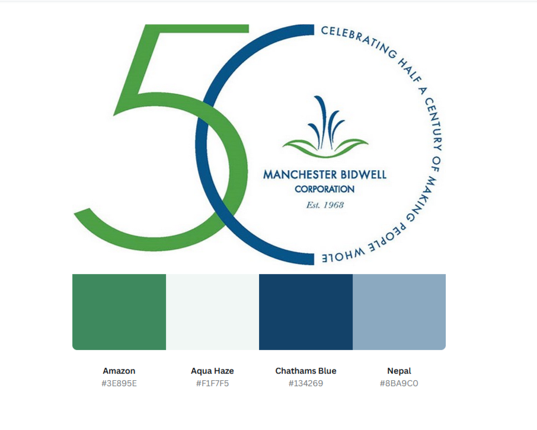
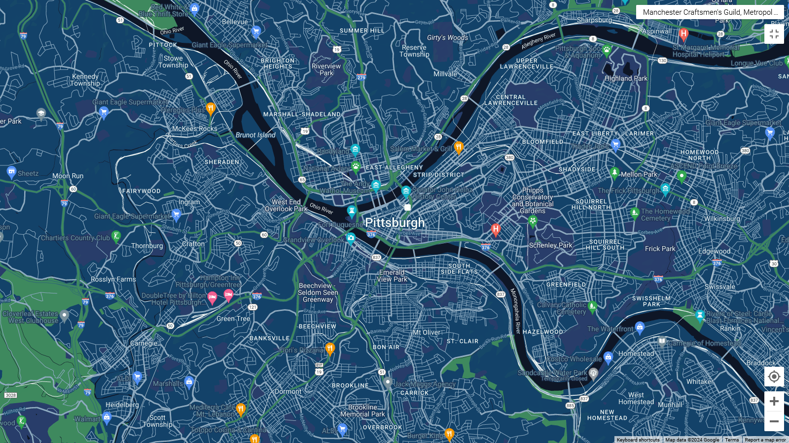
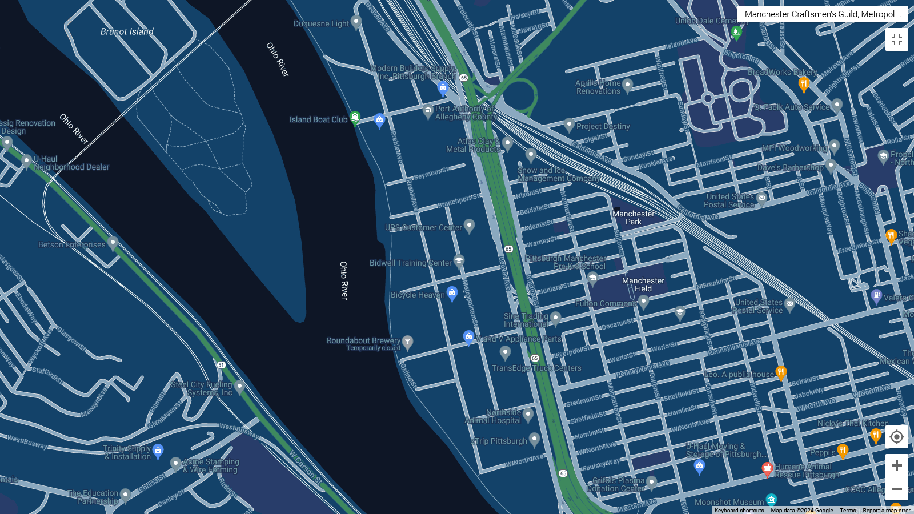
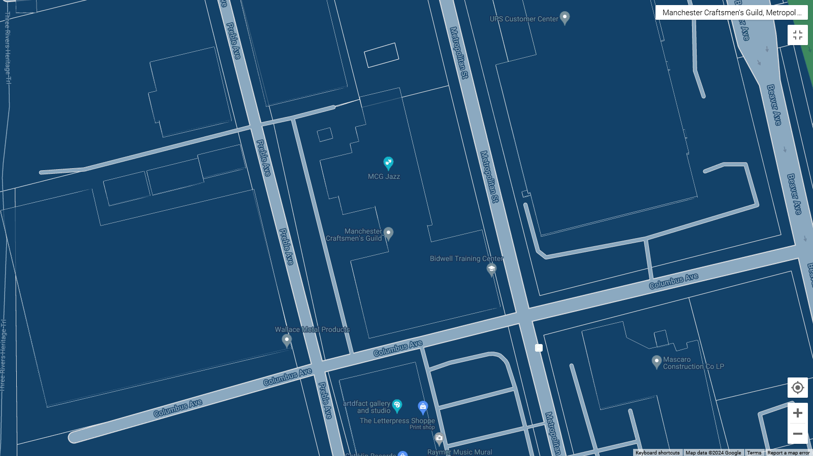

# Custom Google Map for Manchester Bidwell Corporation
**Saul Bezner**

## Proposal
Manchester Bidwell Corporation (MBC) has been a champion of education and arts in the Pittsburgh region for decades. As a parent nonprofit, it finances several affiliate programs, including Bidwell Training Center (BTC) and Manchester Craftsmen’s Guild (MCG). Whether an adult studies medical services, horticulture, chemical laboratory technology, or culinary arts, or a high school student learns ceramics, design, digital arts, or photography, BTC and MCG are unique in their promotion of free and accessible education.

As an organization that advances opportunities for hundreds of residents every year, MBC needs high quality geographic materials to spread its message effectively. Based in the Manchester-Chateau industrial park, MBC bridges two buildings and connects four programs. This means visitors can get easily turned around trying to find the correct building for an affiliate program.

MBC should embed a custom map on its homepage to show visitors that it is a community staple. This would place MBC at the heart of the Manchester neighborhood.

## Time and Labor Estimates

| **Task** | **Description** | **Hours** | **Rate** | **Cost** |
| -------- | --------------- | --------- | -------- | -------- |
| 1 | Develop a custom map | 2 | $100/hour | $200 |
| 2 | Create an accessible web page | 2 | $100/hour | $200 |
| 3 | Draft a map feature lookup table | 1 | $100/hour | $100 |
| 4 | Export and share JSON file | 0.5 | $100/hour | $50 | 
| 5 | Draft instructions for client to embed custom map | 1 | $100/hour | $100 |

## Color Palette and Map Previews

**Figure 1.** Collor Palette for Manchester Bidwell Corporation

**Figure 2.** Wide shot of Pittsburgh.

**Figure 3.** Medium shot of Manchester neighborhood.

**Figure 4.** Close up of Manchester Bidwell Corporation campus.
